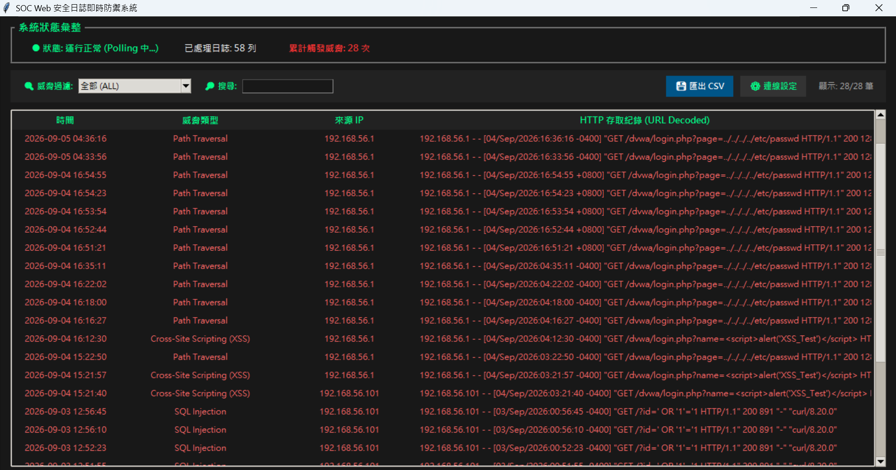
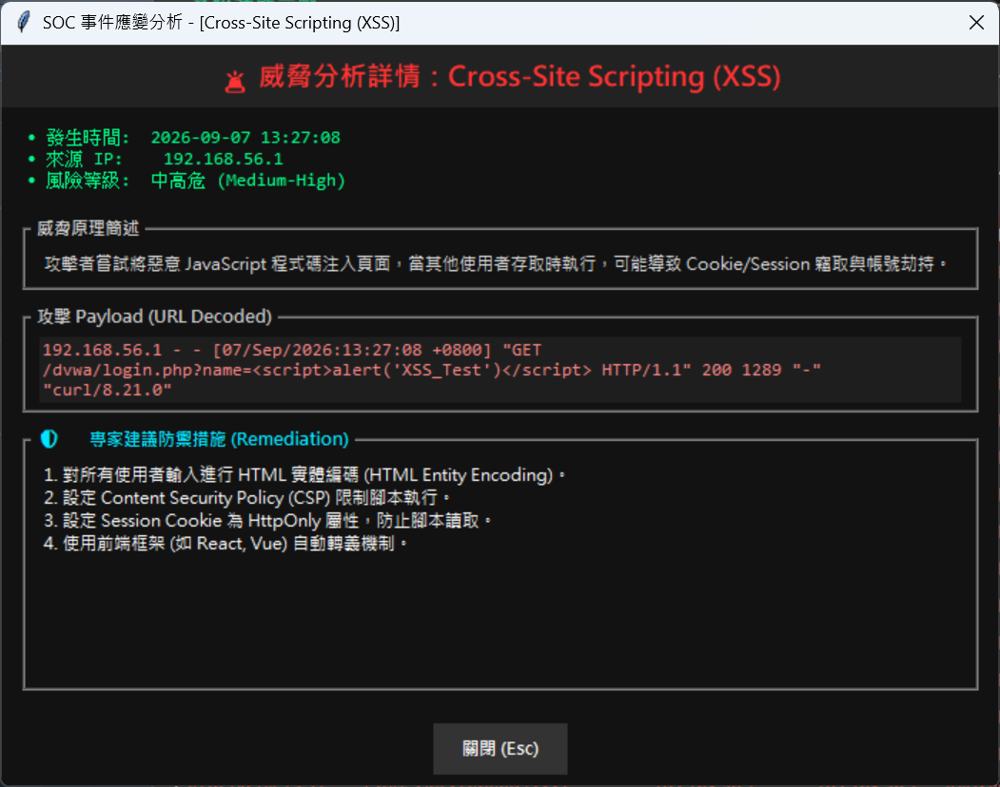
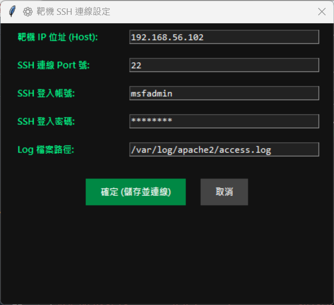

# 🛡️ SOC Web Security Monitoring GUI

一個簡易的 SOC（安全運營中心）Web 日誌即時監控與威脅分析系統。



# 🔍 威脅分析與事件應變 (Threat Analysis & Incident Response)
### 🌟 核心分析功能

- **Payload 深度解碼**：自動解碼 URL Encoding 特徵，還原原始攻擊語法。
- **即時修補建議**：針對 SQLi、XSS 與 Path Traversal 提供藍隊應變措施 (Remediation Advice)。




# ⚙️ 動態連線設定與參數持久化 (Dynamic Connection Settings)

### 🌟 連線模組特色
- **彈性參數配置**：支援動態修改靶機 IP、SSH Port、帳號密碼與 Log 檔案路徑（預設 `/var/log/apache2/access.log`）。
- **輪詢頻率調整**：可彈性自訂背景 Polling 間隔時間（預設 2 秒）。
- **自動化組態管理**：連線設定會自動載入/寫入本地 `settings.json`，提升軟體重用性。

支援在介面運行時動態調整遠端靶機資訊，並將設定自動持久化儲存至本地組態檔：




\## 🌟 系統亮點

\- \*\*即時遠端日誌輪詢\*\*：透過 SSH (Paramiko) 背景抓取 Linux 靶機（Metasploitable2 / Kali）之 Apache `access.log`。

\- \*\*多重威脅特徵分析\*\*：即時比對 SQL 注入 (SQLi)、跨站腳本 (XSS)、路徑遍歷 (Path Traversal) 與漏洞掃描器。

\- \*\*非阻塞 UI 架構\*\*：採用 `threading` 與 `queue` 實現多執行緒傳輸，巨量 Log 刷新時介面依然流暢。

\- \*\*事件應變處置建議 (Incident Response)\*\*：雙擊告警事件即時彈出攻擊 Payload 解析與藍隊修補建議。

\- \*\*動態設定與報表匯出\*\*：支援 Runtime 動態修改連線資訊，並可一鍵匯出 CSV 告警報表。


\## 🛠️ 技術棧

\- \*\*Language\*\*: Python 3

\- \*\*GUI\*\*: Tkinter / ttk

\- \*\*SSH Protocol\*\*: Paramiko

\- \*\*Threat Engine\*\*: Regular Expressions (Regex)

\- \*\*Config \& Report\*\*: JSON, CSV


\## 🚀 快速開始


\### 1. 安裝依賴

```bash

pip install paramiko

